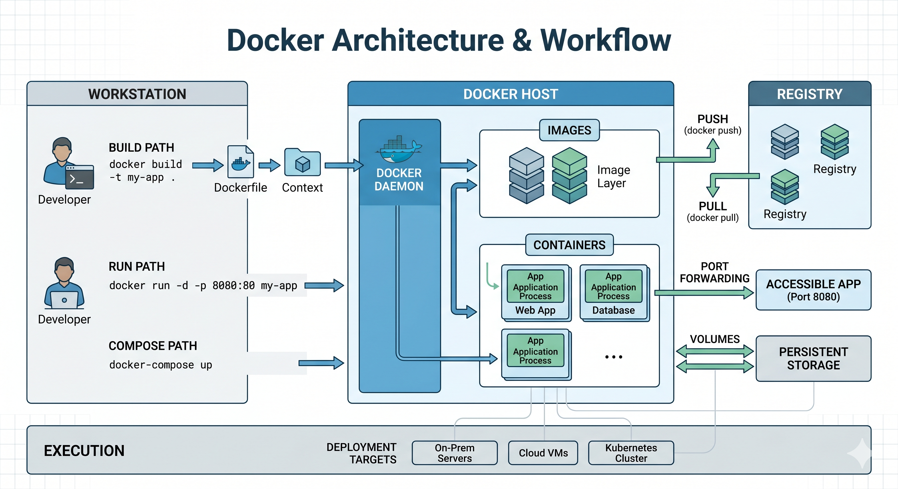

# Docker Basis 🐳

Dự án này chứa các hướng dẫn, ví dụ và cấu hình cơ bản về Docker nhằm giúp bạn nắm vững kiến thức cốt lõi về containerization.

## 📌 Mục lục

- [Giới thiệu](#giới-thiệu)
- [Kiến trúc Docker](#kiến-trúc-docker)
- [Yêu cầu hệ thống](#yêu-cầu-hệ-thống)
- [Nội dung chính](#nội-dung-chính)
- [Hướng dẫn sử dụng nhanh](#hướng-dẫn-sử-dụng-nhanh)
- [Các lệnh Docker phổ biến](#các-lệnh-docker-phổ-biến)

## 📖 Giới thiệu

`docker-basis` được thiết kế để làm tài liệu tham khảo cho việc học Docker, từ cách viết `Dockerfile`, quản lý Image, Container cho đến việc kết hợp nhiều dịch vụ bằng `docker-compose`.

## 🏗 Kiến trúc Docker

Dưới đây là mô hình tổng quan về luồng hoạt động của Docker, từ lúc build image (thông qua Dockerfile) đến khi chạy ứng dụng thực tế trên container:



## 💻 Yêu cầu hệ thống

Trước khi bắt đầu, hãy đảm bảo máy tính của bạn đã cài đặt:

- [Docker Engine](https://docs.docker.com/engine/install/)
- [Docker Compose](https://docs.docker.com/compose/install/)

## 📂 Nội dung chính

- **`Dockerfile/`**: Các ví dụ về cách build image tối ưu cho các ứng dụng như .NET 10 API hoặc ReactJS client.
- **`compose/`**: Các file `docker-compose.yml` mẫu để chạy trọn vẹn một hệ thống gồm Web App và cơ sở dữ liệu (ví dụ: SQL Server).
- **`networks-volumes/`**: Minh họa cách quản lý dữ liệu bền vững (persistent storage) và cấu hình mạng nội bộ giữa các microservices.

## 🚀 Hướng dẫn sử dụng nhanh

### 1. Clone repository

```bash
git clone [https://github.com/hoatt267/docker-basis.git](https://github.com/hoatt267/docker-basis.git)
cd docker-basis
```
